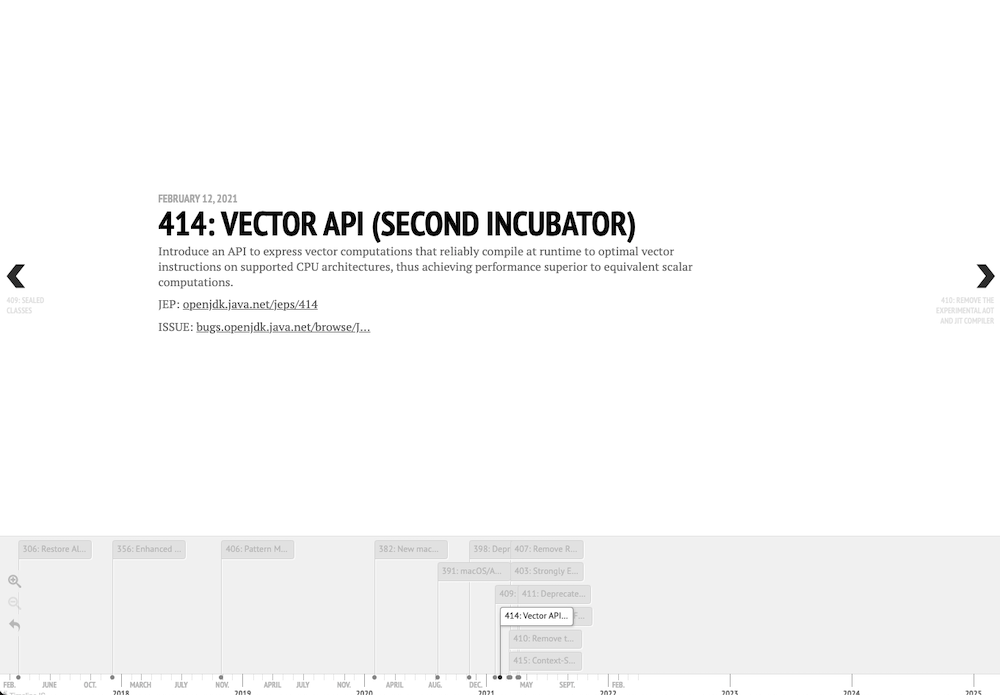

# JEP Visualiser

A little experiment to visualise the JDK releases and their constituent JEPs.

> Live demo available at https://jep-visualiser.herokuapp.com/



## What does it do?

It provides a visual timeline of the JEPs involved in each of the JDK releases.

It does this by scraping data from https://openjdk.java.net, transforming that data and using `TimelineJs` to build the timeline view.

## How do I use it?

Visiting the web root `/` it will default to showing you the JEPs included in JDK 17. There's a drop-down/combo-box for selecting other JDK versions.

To see the JDK versions themselves (and when they were released) visit https://jep-visualiser.herokuapp.com/#jdks

To customise the JEPs included in the timeline just add them as a comma-separated list in the url. For instance, to see all the JEPs that have impact on _Safety_ visit https://jep-visualiser.herokuapp.com/#193,266,338,371,383,385,393,389,396,403,412,414,416,417,419

## How do i run it myself?

Easy, you just use the local run script:

```shell script
./scripts/run-locally.sh
```

Or, you can build and run a Docker container:

```shell script
docker build --tag jep-visualiser .
docker run -it -p 8000:8000 --name jep-visualiser jep-visualiser
```

You'll see a _TON_ of output the first time you run that Docker container. The data collection/transformation only runs on the first container start so subsequent starts will be much quicker.

If you want to trigger the data to be recollected _without_ re-running the contain you can just delete the file marker used to establish if the container has run before.

```shell script
docker exec -it jep-visualiser /bin/sh
rm CONTAINER_STARTED
```

## How do i build and run it as a Docker container?

```shell script
docker build --tag jep-visualiser .
docker run -it -p 8000:8000 jep-visualiser
```

## More details?

The local run script does a couple of things for you:

1. Creates a python virtual environment (with `virtualenv`)
2. Installs python dependencies (with `pip`)
3. Runs `scrapy` spiders to collect jdk and jep data
4. Transforms the jdk and jep data into a format `TimelineJS` can understand
5. Runs a simple HTTP server to serve `TimelineJS` visualisations
